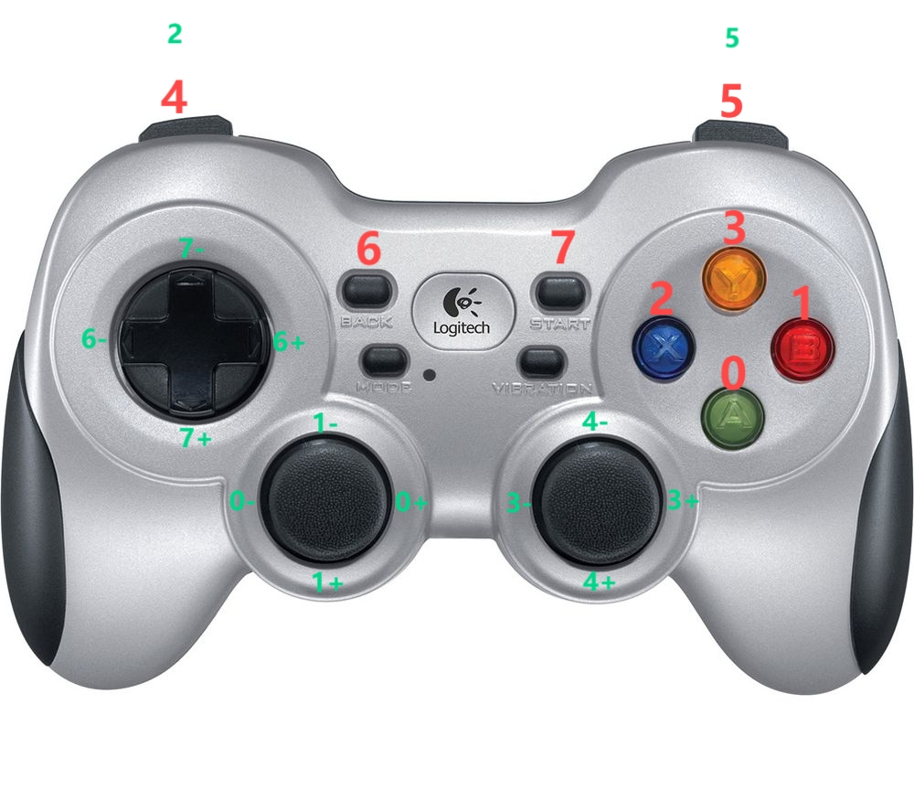

# Joy Stick Module

## 关于手柄

工程中使用手柄型号为 [罗技 F710](https://www.logitechg.com/zh-cn/products/gamepads/f710-wireless-gamepad.940-000172.html?sp=1&searchclick=logi)。

## 手柄设置

查看手柄映射设置 [jstest-gtk](https://github.com/Grumbel/jstest-gtk)

```bash
jstest-gtk
```

默认映射通常如下图，红色是按键，绿色是摇杆




| 按键/摇杆     | topic/srv      | type                    | 功能                                               |
| ------------- | -------------- | ----------------------- | -------------------------------------------------- |
| 按键 7        | /start_control | std_msgs/msg/Float32    | 按下按键发布 topic，用于控制状态机                 |
| 按键 1        | /zero_mode     | std_msgs/msg/Float32    | 按下按键发布 topic，用于控制状态机                 |
| 按键 0        | /stand_mode    | std_msgs/msg/Float32    | 按下按键发布 topic，用于控制状态机                 |
| 按键 2        | /walk_mode     | std_msgs/msg/Float32    | 按下按键发布 topic，用于控制状态机                 |
| 按键 3        | /reset_world   | std_srvs/srv/Empty      | 按下按键发布 srv 请求，用于重置 gazebo 中的模型    |
| 按键 4 + 摇杆 | /cmd_vel       | geometry_msgs/msg/Twist | 用于发布机器人运动指令，左摇杆平面移动，右摇杆旋转 |


